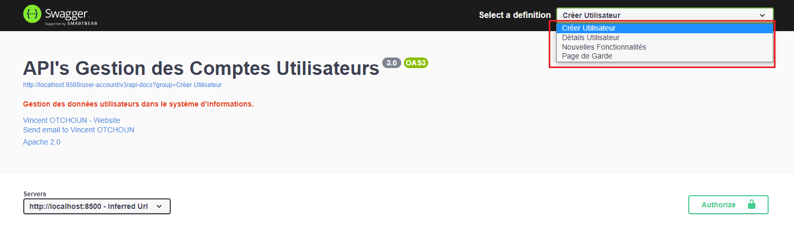
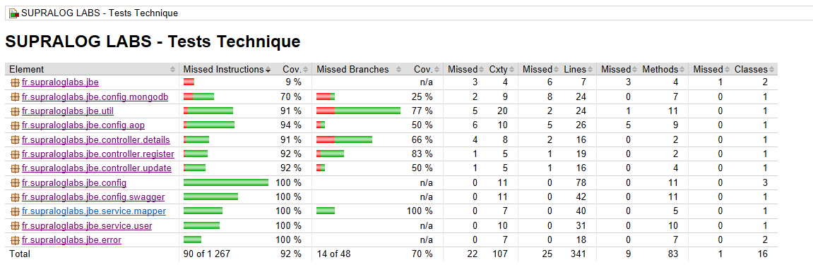

# REST Services


 


## A Propos
C'est une application basée sur une architecture `REST` (`service RESTFul`) exposant ses fonctionnalités au travers d'`API`. Elle est écrite en `Java` 
avec pour socle le Framework `Spring` plus précisement `Spring Boot` qui est une de ces variantes de l'écosystème`Spring`. Elle embarque aussi d'autres technos supplémentaires pour l'impémentation des besoins exprimés.

## Documentation
Cette application est livrée avec des documents situés dans le dossier : `labs-tests-technique/docs/`
- `L'expression des besoins` fournie par le donneur d'ordre  : Test Technique - JAVA BACK END.pdf
- Le document des `Spécifications Techniques Détaillées` : STD_Test_Technique.pdf 

## Stack Technique
Une liste non exhaustive des technos utilisées pour le développement de cette application est présentée ci-dessous :


C'est un projet `Maven` avec `Spring Boot` donc basé sur le langage `Java` : 
- `EA` (Entreprise Architect) pour la fourniture des éléments de modélisation/conception des spécifications techniques fournies.
- `Java 8` est la version du langage utilisé et cible pour l'environnement d'exécution ou de production.
- `MongoDB`, configurations pour les accès aux données en base et pour la réalisation de TI (`_Tests d'Intégration_` : système). L'interface `MongoRepository ` pour les concepts ORM et DAO.
- `Lombok` pour générer du code couramment utilisé et faciliter le maintien du code source propre, simplifier l'écriture des classes.
- `JUnit 5` pour l'écriture des codes sources des classes des Tests Unitaires et/ou d'Intégration.
- `SonarLint` intégré dans l'IDE (_STS_) pour `analyser la qualité du code` livré (_bonnes pratiques de développement_).
- `MoreUnit` intégré dans l'IDE (_STS_) pour `taguer` les classes du code source couvertes par des TU (_Tests Unitaires_).
- `JaCoCo` produire/fournir les rapports de couverture du code source par les différents tests réalisés.
- `Model Mapper` pour la conversion des objets : objets persistants vers `DTO` (Data Transfert Object) et vice versa.
- `Swagger` dans sa version `3.0` pour la documentation et Tests des API proposées par le système d'informations.

## Configurations
Les configurations de l'application permettent de faciliter aussi bien l'exécution que l'exploitation.

### MongoDB 
La base de données cible de l'application est `MongoDB`. Si au démarrage vous obtenez un message du type : `Sessions are not supported by the MongoDB cluster to which this client is connected`, il s'agit d'un
problème de configuration au niveau de la base (ceci veut dire que vous disposez d'un seule instance `MongoDB` autonome : de type `STANDALONE`), donc les tentatives de connexion échouent.
Pour y remédier il faut configurer le `REPLICA_SET` dans le fichier de configuration : `mongod.cfg` selon votre environnement (`Windows,Linux ou macOS`).
- `Windows` le fichier de configuration à modifier se trouve à :` <install directory>/bin/mongod.cfg`
- `Linux` :  `/etc/mongod.conf`
- `Mac` : `/usr/local/etc/mongod.conf`

Dans notre cas de figure (env `Windows`), il faut ajouter les informations ci-dessous et redémarré le service.
```yml
replication:
   oplogSizeMB: 128
   replSetName: "rs0"  -- le nom du REPLICA_SET à fournir dans le fichier des propriétés applicatives pour établir correctement la connexion avec la basede données.
   enableMajorityReadConcern: true
```
Une fois le fichier modifié, par le biais d'une console de type `PowerShell` (par exemple), il faut exécuter les lignes de commandes suivantes:
```sh
$ cd "<install directory>/bin/"
$ mongo.exe
$ rs.initiate() -- pour intialiser le REPLICA_SET défini
$ rs.conf()     -- pour vérifier que la configuration est bien activée
$ exit          -- pour sortir
```

### Configurations applicatives
L'ensemble des configurations applicatives sont consignées dans le fichier : [application.properties](/labs-tests-technique/src/main/resources/application.properties)

```properties
server.port=8500                           # Activer le port d'écoute du serveur
server.servlet.context-path=/user-account  # root contexte de l'application

# Autres propriétés
spring.application.name=user-account       # Le nom de l'application 

#########################
####  MONGODB PROPS  #### 
#########################
# Credentials : informations d'identification à la base de données à renseigner s'il y a lieu 
spring.data.mongodb.authentication-database=
spring.data.mongodb.username=
spring.data.mongodb.password=

# Informations pour la construction de la chaîne de connexion à la base de donnnées.
spring.data.mongodb.replica-set-name=rs0  # le nom du REPLICA_SET.
spring.data.mongodb.database=admin        # le nom de la base de données.
spring.data.mongodb.host=localhost        # l'hôte.
spring.data.mongodb.port=27017            # le port d'écoute du serveur pour l'hôte spécifié.

```

## Points de terminaison REST
L'application fournit des points de terminaison HTTP et des outils pour exposer les fonctionnalités proposées.

### Les points de terminaison REST des fonctionnalités de base 
|Verbe HTTP|URL|Description|Status Codes|
|---|---|---|---|
|`POST`|_http://localhost:${server.port}/${server.servlet.context-path}/api-users/user/register/_|Enregistrer/Sauvegarder dans le SI les informations d'un utilisateur|<ul><li>`200 OK` si succès et retourne les données utilisateur enregistrées</li><li>`4XX ou 5XX` si erreur survenue</li></ul>|
|`GET`|_http://localhost:${server.port}/${server.servlet.context-path}/api-users/user/search/{id}_|Afficher les détails d'un utilisateur enregistré dans le SI|<ul><li>`200 OK` si utilisateur existe et retourne les données utilisateur modifiées</li><li>`4XX ou 5XX` si erreur survenue</li></ul>|

### Les points de terminaison REST des fonctionnalités supplémentaires proposées
Au-délà des fonctionnalités de base, l'application propose également les fonctionnalités supplémentaires suivantes :
|Verbe HTTP|URL|Description|Status Codes|
|---|---|---|---|
|`GET`|_http://localhost:${server.port}/${server.servlet.context-path}/api-users/user/usersr/_|Afficher la liste paginée de l'ensemble des utilisateurs du SI|<ul><li>`200 OK` si succès et retourne la liste paginée</li><li>`4XX ou 5XX` si erreur survenue</li></ul>|
|`DELETE`|_http://localhost:${server.port}/${server.servlet.context-path}/api-users/user/destroy/{id}_|Supprimer les détails d'un utilisateur enregistré dans le SI|<ul><li>`200 OK` si utilisateur existe et retourne un message</li><li>`4XX ou 5XX` si erreur survenue</li></ul>|
|`PUT`|_http://localhost:${server.port}/${server.servlet.context-path}/api-users/user/update/{id}_|Mettre à jour les détails d'un utilisateur enregistré dans le SI|<ul><li>`200 OK` si utilisateur existe et renvoie les données utilisateur mise à jour</li><li>`4XX ou 5XX` si erreur survenue</li></ul>|

URL de base : `http://localhost:${server.port}/${server.servlet.context-path}`

## Compilation, Packaging, Exécution et Documentation
### Compilation et Packaging
L'application a été conçue et développée pour être exécutée à partir d'une archive Java `jar`. L'arxhive exécutable peut être générée de deux façons :
- un build `Maven` : ceci suppose que l'outil `Maven` soit prélablement installé sur le post de travail
- un build à partir de l'environnement intégré de développment utilsé
Pour `Maven`, exécuter la commande ci-dessous :
```bash
$ mvn clean package
```
Il nettoiera, compilera et générera l'archive exécutable le `.jar` dans le répertoire cible, par exemple `labs-tests-technique-0.0.1-SNAPSHOT.jar`

### Exécution
Les points ci-dessous présentent les différentes façons d'exécuter l'application.
- Cycle de vie Maven
```bash
$ mvn spring-boot:run
```
- Ligne de commande
```bash
$ java -jar labs-tests-technique-0.0.1-SNAPSHOT.jar
```
- Ligne de commande avec surcharge des fichiers de base

Il peut y arriver qu'on veuille écraser les configuration de base par des fichiers externes (fichier de propriétés, logger, ....). Dans ce cas la commande est la suivante :
```bash
$ java -Dlogging.config=file:${SRVC_HOME}/logback-spring.xml -jar labs-tests-technique-0.0.1-SNAPSHOT.jar -Dspring.config.location=file:${SRVC_HOME}/application.properties
ou
$ java -Dlogging.config=file:${SRVC_HOME}/logback-spring.xml -jar labs-tests-technique-0.0.1-SNAPSHOT.jar --spring.config.location=file:${SRVC_HOME}/application.properties
```
Où `SRVC_HOME = <chemin d'accès aux fichiers concernés>`

### Documentation Swagger
En dehors du document des spécifications techniques fournies, l'application embarque en son sein  `Swagger ` pour produire la documentation des API proposées par l'application.
Il permet également de tester les API's. Au démarrage de l'application, il est accessible par l'URL fournie ci-dessous :
```html
http://localhost:${server.port}/user-account/swagger-ui/index.html
ou da façon générique :
http://localhost:${server.port}/${server.servlet.context-path}/swagger-ui/index.html
```
La configuration fournie dans l'application est la suivante :


La configuration définie dans l'application fournit un ensemble de définitions décrites dans le tableau ci-dessous
|Défintion|Description|
|---|---|
|`Créer Utilisateur`|_API de création des données d'un nouvel utilisateur dans le SI_|
|`Détails Utilisateur`|_API permettant de remonter les détails d'un utilisateur existant dans le SI_|
|`Nouvelles Fonctionnalités`|_API fournissant les opérations suivantes : <ul><li>Mise à jour des données d'un utilisateur existant dans le SI</li><li>Suppression du SI des données d''un utulisateur existant</li><li>Afficher la liste paginée des utilisateurs du système</li></ul>_|
|`Page de Garde`|_Ensemble des API's proposées par le système d'informations_|


## Tests

### Types de Tests
- `Tests unitaires` : pas seulement pour un effet de test immédiat du code, mais également permettre d'effectuer des tests de non-régression.
- `Tests d'intégration` : assurer que le comportement de l'application est toujours aussi conforme, au fur et à mesure de l'assemblage des unités de code. Nous couvirons les deux types à savoir :
	- `Tests d'intégration composants` : vérifier que les unités de code fonctionnent corectement ensemble,c'est-à-dire de manière isolée : `Est-ce que les classes testées unitairement fonctionnent vraiment bien ensemble ?`
	- `Tests d'intégration système` : vérifier le bon fonctionnement de plusieurs unités de code au sein d'une configuration d'application (liens avec des composants extérieurs comme une base de données par exemple) : `Comment pouvons-nous rapidement tester que notre application en fonctionnement collaborerait avec le monde extérieur ?`
- `Tests fonctionnels` : Pas d'interfaces utlisateur dans le cadre de cete application pour effetuer les tests `end-to-end`. Mais les fonctionnalités exposées par les API seront testées au travers de l'outil `Postman`.

### Outils de Tests 
La partie `test` de l’écosystème `Spring` (Framework de base de l’application) plus précisément sa composante : `spring-boot-starter-test`, avec ses apports : `spring-test, spring-boot-test, spring-boot-test-autoconfigure`, 
fournit des outils permettant la réalisation des types de tests cités ci-dessus.
Le tableau ci-dessous dresse une liste des outils disponibles pour la réalisation des Tests :

|Outil|Description|
|---|---|
|`Mockito/BDDMockito`|_pour les mocks /Style d'écriture des tests de développement (Behavior Driven Development)  piloté par le comportement, il utilise : //given //when //then_|
|`JUnit 5`|_pour l'écriture des classes des Tests Unitaires et d'intégration_|
|`Assert-J`|_pour les assertions_|
|`Postman`|_pour tester les fonctionnalités exposées par les API_|
|`JaCoCo`|_Plugin maven (avec les plugin surefire et failsafe) pour produire/fournir les rapports de couverture de codes_|
|`Swagger`|_Pour générer la documentation et Tester les REST API_|

### Rapports de couverture de codes
Comme mentionné ci-dessus la couverture de codes par les tests mis en place et exécutés, est mesurée et fournie par `JaCoCo`. L'image ci-dessous fournit la couverture du code de l'application à l'exception des objets de couche de modèle de modèles de données.

La copie d'écran ci-dessous fournit l'image de la couverture de codes de l'application.

